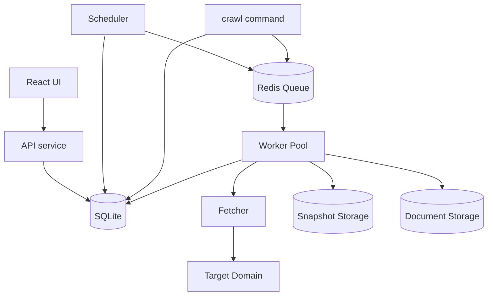

# Chelicera

Single-target OSINT reconnaissance crawler with a Go backend and a React graph-visualization frontend.

---

## Overview

Chelicera crawls a single target domain and builds a structured knowledge graph of everything it finds — pages, JS/CSS assets, API endpoints inferred from client-side code, exposed secrets and PII, linked documents, DNS records, TLS certificate data, and any external domains referenced along the way. Everything is stored in SQLite and explorable through a web UI that renders the results as an interactive graph.

It's built for OSINT and reconnaissance work: understanding the surface of a target — what it exposes, what it links to, what accidentally leaked into client-side code — without manual page-by-page inspection. The intended user is the same person running the tool: single-target, ad-hoc or scheduled recon rather than a hosted multi-tenant scanning platform.

The repository is organized as one Go module producing a single binary with three subcommands (`crawl`, `scheduler`, `api`), plus a separate React/TypeScript frontend, all wired together with Docker Compose.

---

## Engineering Summary

The project demonstrates a complete backend build: a worker-pool crawler with per-domain rate limiting, a Redis-backed job queue with deduplication, a normalized SQLite schema modeling a proper knowledge graph (nodes and typed relations), a REST API serving that data, and a containerized multi-service deployment.

What stands out from an engineering perspective is the batching discipline in the storage layer — findings, relations, and discovered domains from a single page are collected in memory and flushed in one SQL transaction rather than one round-trip per item — and the handling of a real correctness problem: `INSERT OR IGNORE` doesn't reliably return the ID of a pre-existing row, so building graph edges after a dedup-safe batch insert requires a separate ID-resolution pass, which the store package does explicitly. The test suite (roughly 2,800 lines against ~4,800 lines of application code) and a CI pipeline running the race detector with per-package coverage reporting also point to this being treated as production-grade rather than a one-off script.

---

## Key Features

* Worker-pool crawler with configurable concurrency and per-domain rate limiting
* Redis-backed job queue with `BRPOPLPUSH`-based reliable dequeue and `SETNX` deduplication
* Knowledge-graph data model — pages, assets, endpoints, findings, and domains connected by a typed relations table
* Static JS analysis to infer API endpoints from client-side code
* 30+ regex-based OSINT detectors covering emails, cloud storage buckets, cloud provider credentials, SaaS API keys, JWTs, private keys, and social profile links
* Passive DNS resolution and TLS certificate inspection, run concurrently with the crawl itself
* robots.txt and sitemap parsing to seed and constrain the crawl
* Streaming document downloader (PDF/DOCX/XLSX/etc.) with a disk-space budget and per-file size limits
* Content-addressed snapshot storage (gzip, SHA-256 filenames) that deduplicates identical content automatically
* Interactive graph UI (React + vis-network) for exploring crawl results

---

## Technical Stack

**Backend**
Go 1.25, `chi` router, `zap` structured logging

**Database**
SQLite (WAL mode) via `mattn/go-sqlite3`

**Queue**
Redis via `go-redis/v9`

**Frontend**
React 18, TypeScript, Vite, Tailwind CSS, `vis-network` / `vis-data`

**Parsing / Extraction**
`goquery` (HTML), `miekg/dns` (DNS), `pdfcpu` (PDF metadata)

**Infrastructure**
Docker, Docker Compose, GitHub Actions

**Testing**
Go's built-in testing package with `-race`, `miniredis` (in-memory Redis for tests), Vitest, MSW (API mocking) on the frontend

---

## Architecture

The system is one Go binary with three run modes, sharing the same codebase and data model:

* **crawler** — one-shot: seeds a start URL, runs a worker pool against the Redis queue until it drains, then exits
* **scheduler** — long-running: polls SQLite every minute for targets due for a re-crawl and enqueues new crawl runs
* **api** — long-running: serves crawl results over REST/JSON to the frontend

Each crawl run kicks off three independent goroutines alongside the main worker pool: one fetches robots.txt and sitemaps to seed additional URLs, one resolves DNS records, and one performs a passive TLS handshake to read the target's certificate. None of these touch the fetch/queue pipeline, so they can't slow down or be slowed down by the crawl itself.

Each worker pulls a job, fetches the URL, and depending on content type either parses HTML (extracting links, assets, and OSINT findings), statically analyzes JS (extracting inferred endpoints and findings), or streams a document to disk. Everything discovered from a single page — findings, relations, external domains — is batched and flushed to SQLite in one transaction.

---

## Interesting Engineering Decisions

**SQLite over a network database.** This is a single-target tool run per-crawl, not a multi-tenant service — SQLite in WAL mode gives concurrent reads (the API can serve results while a crawl is writing) with a single serialized writer, which matches the actual concurrency needs without operating a separate database server.

**Redis for the job queue, not an in-process channel.** `BRPOPLPUSH` moves a job atomically from the pending list to a processing list, so a crawler process dying mid-job doesn't silently drop it — it can be found sitting in `crawl:processing`. Deduplication is a `SETNX` per URL per crawl run, which is simpler and cheaper than tracking visited state in SQLite under write contention from the workers.

**One binary, three subcommands.** Crawler, scheduler, and API share the models, store, and config packages directly — no serialization layer or internal API between them, since they all read and write the same SQLite file. This keeps three genuinely different runtime concerns (batch job, cron-like poller, HTTP server) in one deployable artifact instead of three codebases to keep in sync.

**Content-addressed snapshot storage.** Pages and assets are saved as `<hash>.gz` rather than by URL. Fetching the same content twice (a common case — shared JS bundles, repeated headers/footers) costs one disk write instead of many.

**Passive TLS/DNS recon as a design choice, not an afterthought.** `InspectTLS` deliberately sets `InsecureSkipVerify: true` — the goal is reading whatever certificate the server presents, valid or not, since an expired or misconfigured cert is itself a finding worth recording, not an error to swallow.

---

## Challenges

**Crawl traps.** Query parameters like `?page=`, `?sort=`, or session tokens can turn a finite site into an effectively infinite one. `NormalizeParams` strips a fixed set of known-noisy parameter names before a URL is deduplicated or enqueued.

**Building graph edges after deduplicated batch inserts.** `INSERT OR IGNORE` is the right tool for idempotent, dedup-safe writes, but it doesn't reliably return the row ID when a row already existed. The store package handles this with a second pass — `GetFindingIDs` and `GetEndpointIDsByPage` — that resolves (type, value) or (page, path, method) back to IDs after the batch insert, so relations can still be built correctly even when many pages reference the same finding.

**Bounding document storage.** Downloading arbitrary linked documents from a target could exhaust disk space. `DiskBudget` reserves bytes as a stream is being written and releases them if the write fails, combined with a hard per-file size cap, so a single large or malicious file can't blow the budget silently.

**Coordinating async seeding with queue drain detection.** robots.txt/sitemap parsing runs in its own goroutine and can take several seconds on a large sitemap. The main loop waits 15 seconds before it starts polling for an empty queue, specifically to avoid declaring the crawl "done" before the sitemap goroutine has had a chance to enqueue anything. It's a pragmatic fix rather than an elegant one — a signal-based handoff would remove the fixed wait, and is a reasonable next improvement.

---

## Performance & Scalability

* Configurable worker pool size (`WORKER_COUNT`) for concurrent fetches
* Per-domain rate limiting (`RATE_LIMIT_RPS`) enforced independently of pool size, so raising concurrency doesn't mean hammering the target harder
* Response bodies capped at 10MB on read to prevent memory exhaustion from a single oversized response
* Document downloads are streamed in 32KB chunks directly to disk rather than buffered in memory
* Batched transactional writes (findings, relations, domains, assets, endpoints) instead of per-row inserts
* SQLite tuned for this workload: WAL journaling, `NORMAL` synchronous mode, ~40MB page cache, 256MB memory-mapped reads

No load or throughput benchmarks are present in the repository — these are implementation choices, not measured numbers.

---

## Reliability

* Graceful shutdown via `signal.NotifyContext`, propagated through `context.Context` to the worker pool, fetch calls, and all three background goroutines
* Failed jobs are moved to a separate `crawl:failed` Redis list rather than dropped — visible for inspection, though there's no automatic retry logic on top of this
* Docker Compose gates dependent services on Redis's healthcheck (`condition: service_healthy`) rather than just container start order
* Structured logging (`zap`) throughout, with consistent fields (worker ID, URL, depth, run ID) for tracing a crawl after the fact
* Snapshot writes check for an existing file by hash before writing, so a crash mid-crawl and restart doesn't duplicate storage on re-fetch

---

## Security Considerations

* All configuration (Redis address, DB path, rate limits, user agent) comes from environment variables — nothing sensitive is hardcoded
* All SQL is parameterized (`?` placeholders) throughout the store package — no string-built queries
* CORS on the API is restricted to a specific origin (`http://localhost:5173`) rather than left open
* The API has no authentication layer — reasonable for a tool designed to run locally against your own infrastructure, but worth being explicit about: it is not built for exposure on a public network as-is
* `InsecureSkipVerify` in the TLS inspector is intentional (reading whatever cert is presented, for recon purposes), not an oversight — worth flagging so it isn't mistaken for a bug elsewhere
* The document downloader enforces both a per-file size limit and a shared disk budget, limiting the blast radius of a target that serves an unexpectedly large or malicious file

---

## Lessons Learned

The batching work in the store package was the part that took the most iteration — it's easy to write correct code that does one `INSERT` per finding, and much less obvious how to keep that correct once you also want one transaction per page and safe deduplication across an entire crawl run. The two-pass approach (batch insert, then resolve IDs to build relations) ended up being the cleanest way to keep both properties without either giving up dedup or making relation-building fragile.

If I were extending this further, the fixed 15-second wait before drain detection is the first thing I'd replace — it works, but it's a wait tuned to "should be enough," not a real synchronization primitive. A more explicit signal from the seeding goroutine back to the drain check would remove that guess entirely.

---

## Technologies Demonstrated

* Concurrent worker-pool design in Go
* Distributed queue design with reliable dequeue and deduplication
* Relational schema design for a graph-shaped problem (typed nodes + typed edges)
* Transactional batch writes and post-hoc ID resolution around deduplicated inserts
* REST API design and JSON serialization
* Static analysis of client-side JavaScript for endpoint discovery
* Passive network reconnaissance (DNS, TLS)
* Streaming I/O with bounded memory and disk usage
* Multi-service containerized deployment
* CI pipeline design with race detection and coverage reporting

---

## Suitable Portfolio Categories

Backend Engineering · Automation · Distributed Systems · API Design · Infrastructure · OSINT Tooling

---

## SaaS Extension

Chelicera's core crawler became the seed for a separate, closed-source SaaS platform — not published, still in active development — that reworks the same ideas into a multi-tenant, billed product built around social-profile investigations rather than single-domain crawling.

### What Changed

The data model moved from Chelicera's fixed tables (pages, assets, endpoints, findings, domains, each with its own columns) to a single polymorphic `Entity`/`Relation` model: every discovery — a page, an email, a GitHub repository, a VK profile — is a row in one table, distinguished by a `Type` field and a free-form JSONB `Attributes` column. Adding a new kind of discovery becomes a Go-level convention instead of a schema migration.

Collection itself became pluggable. A `Collector` interface defines exactly one contract — take a task, return discoveries, touch no database or queue — and a `Registry` decides which collector handles which kind of discovery next. The generic worker that persists results has no knowledge of what a "GitHub profile" or a "VK collector" actually is; it just knows how to run a `Collector` and store what comes back. This is what let a second platform (GitHub) and a third (VK, with full OAuth) get added without touching the crawl/storage core.

The storage backend moved from SQLite to PostgreSQL, since the product is now meant to run as a persistent multi-user service rather than a per-run local tool. A Telegram bot became the primary interface — submitting a profile URL, tracking investigation progress, and paying for investigations all happen there — with billing handled through a tiered system: a free trial per platform, a small global free allowance, then a paid balance, topped up via Telegram Stars or a cryptocurrency payment provider.

### Notable Engineering Additions

**Field-level encryption at rest.** VK OAuth access and refresh tokens are encrypted with AES-256-GCM before being stored in Postgres, using a key supplied at process startup — the process refuses to start rather than silently falling back to storing plaintext if the key is missing.

**PKCE OAuth implemented against the actual spec.** The VK login flow implements PKCE (code verifier/challenge generation, state parameter) directly against VK's published OAuth documentation rather than relying on a generic OAuth library, since VK's implementation has specific requirements (character alphabet, minimum lengths, device ID reuse across refresh calls) that a generic client wouldn't necessarily handle correctly.

**Payment webhook verification.** The cryptocurrency payment integration verifies incoming webhooks using the exact signature algorithm specified in that provider's documentation (`HMAC-SHA256` over the raw request body, keyed by `SHA256` of the app token) — implemented against the raw bytes specifically, since re-serializing parsed JSON before hashing would produce a signature that doesn't match.

**Self-contained HTML reports, safely.** Each investigation produces a standalone HTML report with the full graph embedded as JSON inside a `<script>` tag — deliberately relying on `encoding/json`'s default HTML-safe escaping (`<`, `>`, `&` escaped to Unicode sequences) rather than disabling it for cleaner-looking output, since the embedded data originates from crawled pages and is not trusted input.

**Tiered trial-then-paid billing.** Charging for an investigation checks, in order, whether the user has an unused free trial for that specific platform, then a small global free allowance, then falls back to their paid balance — implemented as a single function with an explicit outcome type rather than scattered conditionals, so the billing logic is one thing to test and reason about.

### Status

This extension is closed-source and not yet publicly released — described here to show the direction the underlying engineering took, not as a live product.