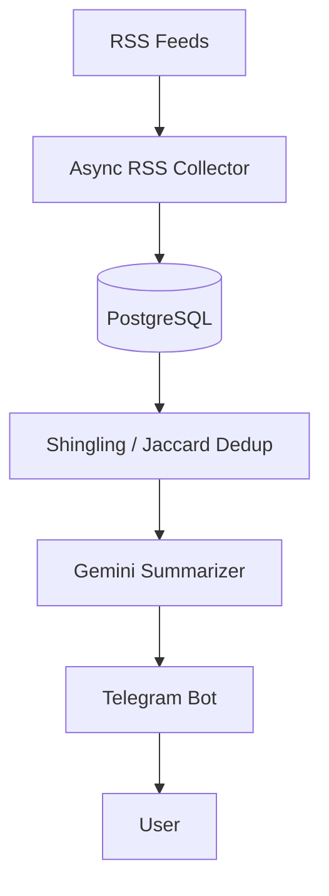

# News Summary Bot

A Telegram bot that collects news from RSS feeds, deduplicates near-identical reposts, and delivers AI-generated summaries. Open source, development halted — the README explains why.

---

## Overview

The idea: point the bot at a set of RSS feeds (via a self-hosted RSSHub instance, since Cloudflare blocks the public one), pull in articles, filter out both exact duplicates and near-duplicate reposts/rephrasing across sources, and hand what's left to an LLM to summarize before delivering it through Telegram — a straightforward pipeline: collect → store → filter → process → deliver.

Development stopped, and the README says exactly why: the free tier of Gemini's API turned out to be unworkable for this use case — aggressive rate limiting, no caching on the free tier, servers frequently returning 503s, and responses sometimes truncating mid-generation. Rather than paper over that, it's stated directly. What exists is a working pipeline up to and including the summarization call; the project just hit an external wall rather than an internal one.

---

## Engineering Summary

The most interesting piece of engineering here isn't the bot or the RSS fetching — it's the deduplication layer. Exact-duplicate filtering happens cheaply via content hashing at the storage layer, but the real problem is near-duplicates: different channels reposting or lightly rephrasing the same story, which a hash-based check misses entirely and which would otherwise burn LLM tokens summarizing the same news multiple times. That's handled with W-shingling and Jaccard similarity — a real, citation-backed information-retrieval technique — comparing recent posts against each other and dropping anything above a similarity threshold before it ever reaches the LLM call.

The rest of the pipeline is competently built: async RSS fetching across many feeds concurrently, a SQLAlchemy-based storage layer, and retry-with-backoff around the LLM call (via `tenacity`) to at least partially absorb the rate-limit problems the README describes.

---

## Key Features

* Async RSS collection across multiple feeds concurrently, with per-item hashing for exact-duplicate detection
* Near-duplicate filtering via W-shingling + Jaccard similarity, run before any LLM call
* HTML content cleaning/normalization on ingested articles
* LLM-based summarization (Gemini) with retry and exponential backoff
* Per-user encrypted API key storage (Fernet/AES) — laying groundwork for a planned "bring your own key" model
* Telegram bot delivery layer
* Fully containerized via Docker Compose

---

## Technical Stack

**Backend**
Python (asyncio), SQLAlchemy (async), PostgreSQL

**Bot**
python-telegram-bot (or equivalent), Telegram Bot API

**RSS / Parsing**
`feedparser`, `aiohttp`, BeautifulSoup-based HTML cleanup

**AI**
Google Gemini API, `tenacity` for retry/backoff

**Security**
`cryptography` (Fernet) for encrypted API key storage

**Infrastructure**
Docker, Docker Compose

---

## Architecture

RSS feeds are fetched concurrently and parsed into a normalized item structure, each hashed for exact-duplicate detection before being stored. A separate filtering pass pulls recent unsummarized posts, computes word-shingle sets for each, and greedily drops any post whose Jaccard similarity to an already-kept post exceeds a threshold — leaving a deduplicated set that gets formatted as XML and sent to the LLM in a single batch per pass. The AI layer wraps the actual model call in retry logic before handing the result back to the bot layer for delivery.

---

## Interesting Engineering Decisions

**Fuzzy deduplication before the LLM call, not after.** Hash-based dedup only catches byte-identical content, which near-duplicate news reposts almost never are. Running shingling/Jaccard similarity as a pre-filter — before spending any tokens — directly targets the actual cost driver (redundant LLM calls on effectively-the-same story), not just exact repeats.

**Retry with exponential backoff around the LLM call.** Given how unreliable the free-tier API turned out to be in practice, wrapping the generation call in `tenacity`'s retry/backoff was a reasonable defensive measure — it didn't fully solve the underlying reliability problem, but it's the correct shape of fix for transient failures.

**Encrypting API keys at rest before the feature that needs it was finished.** The plan was to let users bring their own API keys (to spread load/cost across multiple accounts); the encryption layer for storing those keys safely was built ahead of the feature using it — a reasonable order to build things in, security first, rather than bolting encryption on after keys were already being stored in plain text.

---

## Challenges

**Distinguishing real duplicates from independently similar but distinct stories.** A pure exact-match hash misses reposts and rephrasing; a too-aggressive similarity threshold would incorrectly merge genuinely different stories about the same event. The shingle-size and similarity-threshold parameters are exposed as configuration specifically because getting this balance right isn't a one-size-fits-all constant.

**Working around a genuinely unreliable upstream API.** Aggressive free-tier rate limits, no caching, and responses that truncate mid-generation are external constraints, not design flaws in this codebase — retry/backoff mitigates some of it, but ultimately the project ran into a wall that better engineering on this side couldn't fully solve.

---

## Reliability

RSS fetch failures for individual feeds are caught and logged without aborting the batch — `fetch_many` uses `asyncio.gather(..., return_exceptions=True)` specifically so one broken feed doesn't take down the rest of the collection run. The LLM call layer retries transient failures with backoff before giving up.

---

## Security Considerations

* API keys (the planned per-user bring-your-own-key model) are encrypted at rest using Fernet symmetric encryption, not stored in plaintext
* No credentials are hardcoded — configuration is entirely environment-variable driven
* The bot's own LLM API key is kept out of the checked-in config, injected at runtime

---

## Lessons Learned

The shingling-based deduplication is the piece worth carrying forward into future projects — it's a general technique, not specific to news, and solves a real problem (near-duplicate content inflating LLM costs) that a lot of naive pipelines don't bother addressing. The other lesson is more about scoping: building against a free-tier third-party API without first confirming it can actually sustain the intended usage pattern is a costly way to find out it can't. Worth validating that constraint earlier next time, before the rest of the pipeline is built around it.

---

## Technologies Demonstrated

* Near-duplicate detection (W-shingling, Jaccard similarity)
* Async I/O for concurrent external data collection
* LLM integration with retry/backoff for unreliable upstream APIs
* Encrypted credential storage
* Telegram bot development
* SQLAlchemy async ORM usage

---

## Suitable Portfolio Categories

Backend Engineering · Automation · Telegram Systems · Open Source