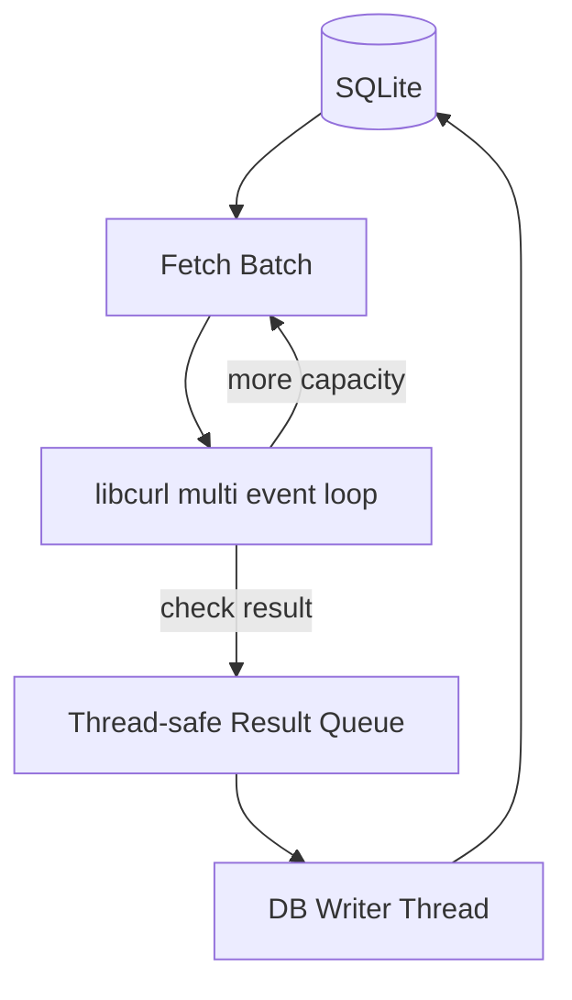

# Proxyc

A high-performance proxy checker and manager written in C — a full rewrite of [Proxy Strainer](../labs/proxy_strainer.md), moving from thread-per-proxy Python to a single-threaded async event loop.

---

## Overview

Proxyc does the same job as its Python predecessor — validate proxy lists and confirm which ones are actually alive and working — but rebuilt around a fundamentally different concurrency model. Instead of spawning threads per proxy, it drives libcurl's multi-interface in a single event loop, checking hundreds to thousands of proxies concurrently from one thread with minimal memory overhead. Everything is backed by a single SQLite table, with a CLI for importing, checking, retrying, exporting, and viewing stats.

Status: finished. It was built both to solve a real performance ceiling in the original Python version and specifically to learn C.

---

## Engineering Summary

This is a legitimate systems-programming project, not just a language port. The checker uses libcurl's multi-interface (`curl_multi_perform`/`curl_multi_wait`) to run non-blocking I/O across a configurable number of concurrent connections in one thread, avoiding the context-switching cost that thread-per-connection concurrency runs into at scale. Results flow through a thread-safe queue (mutex + condition variable) to a dedicated database-writer thread, which batches updates into SQLite transactions rather than committing one row at a time. The database itself is tuned with the same pragma set seen elsewhere in this portfolio's Go/SQLite work — WAL mode, `NORMAL` synchronous, larger cache, in-memory temp store — applied here in raw C via the SQLite C API directly.

CI reflects the seriousness of the memory-safety concerns that come with writing C by hand: `cppcheck` static analysis, a debug build, and then valgrind's memcheck run against every actual CLI operation (import, check, export, stats) checking for leaks — not just a build-and-hope pipeline.

---

## Key Features

* Single-threaded async proxy checking via libcurl's multi-interface — thousands of concurrent checks without thread-per-connection overhead
* Dedicated database-writer thread consuming from a thread-safe queue, batching SQLite writes into transactions
* Hand-written proxy syntax validation (IP/port/scheme parsing) via direct pointer arithmetic, no regex
* IP-mismatch detection — confirms the response actually originated from the proxy's own address, not just that it returned 200
* Bulk import inside a single SQL transaction, with per-line syntax validation and duplicate skipping
* CLI subcommands for import, check, retry, export (with scheme filtering), and stats
* CI pipeline with static analysis (cppcheck) and full valgrind memory-leak verification against real CLI runs

---

## Technical Stack

**Language**
C (C11)

**Networking**
libcurl (multi-interface, async)

**Database**
SQLite3 (C API, WAL mode)

**Concurrency**
POSIX threads (mutex, condition variables)

**Build**
GNU Make

**CI**
GitHub Actions — cppcheck static analysis, release + debug builds, valgrind memcheck against every CLI operation

---

## Architecture

The main loop fetches a batch of unchecked proxies from SQLite, adds each as an easy handle to a `curl_multi` instance up to the configured concurrency limit, and drives the loop with `curl_multi_perform`/`curl_multi_wait` until handles complete. As each check finishes, its result is classified (success, timeout, connection error, IP mismatch, HTTP error) and pushed onto a thread-safe linked-list queue. A separate writer thread drains that queue continuously, applying updates to SQLite in batches of 200 inside explicit transactions, so the checking loop is never blocked waiting on disk I/O.

---

## Interesting Engineering Decisions

**libcurl's multi-interface over a thread pool.** The Python original used a `ThreadPoolExecutor` capped at 120 workers — reasonable for Python, where threads carry real OS overhead. In C, checking proxies is I/O-bound, so a single event loop managing thousands of non-blocking sockets does the same job with a fraction of the memory and no context-switching cost at all. This is the core reason the rewrite exists.

**A separate writer thread instead of writing from the event loop.** SQLite writes involve disk I/O, which would stall the network event loop if done inline. Pushing results to a queue and letting a dedicated thread handle all database writes keeps the checking loop free to keep driving network I/O continuously.

**Hand-rolled proxy syntax validation over regex.** C doesn't have a batteries-included regex library the way Python does, and for a fixed, well-defined grammar (scheme, optional auth, IP, port), direct character-by-character validation is both faster and easier to reason about than compiling a pattern.

**Batched transactions on both import and write-back.** Both the bulk importer and the result writer commit every N rows (5000 and 200 respectively) instead of once per row or once for the whole batch — balancing transaction overhead against how much work would be lost or held in memory between commits.

---

## Challenges

**Avoiding I/O stalls in a single-threaded event loop.** Any blocking call inside the main loop would stall every in-flight connection. Solved by keeping the loop strictly to libcurl's non-blocking multi-interface calls and moving all database writes to a separate thread entirely.

**Correctly attributing curl error codes to the same error taxonomy the Python version used.** Timeout, connection error, DNS resolution failure, and read/send errors are each mapped explicitly from libcurl's `CURLcode` values, preserving the same error categorization the original tool used — useful for comparing behavior between the two implementations.

**Memory safety in a language with no garbage collector.** Every allocation (`ResultNode`s, address arrays, handle contexts) has to be freed on every code path, including error paths. This is exactly what the CI valgrind stage exists to catch — running full memcheck against every real CLI operation, not just a synthetic test.

---

## Performance & Scalability

* Default concurrency of 512 simultaneous connections, configurable via `--threads`
* Batched proxy fetching from SQLite (default batch size 2000) rather than loading an entire list into memory at once
* Batched database writes (200 rows per transaction) to amortize commit overhead
* WAL mode and tuned SQLite pragmas for write throughput

No formal before/after benchmarks are included in the repository — the performance claim is architectural (async I/O vs. thread-per-connection), not backed by a published number.

---

## Reliability

* `INSERT OR IGNORE` on import avoids duplicate proxy rows without a separate existence check
* Database writer commits in bounded batches, so a crash loses at most one partially-filled batch rather than the whole run
* CI runs valgrind's memcheck (leak-check=full, track-origins) against import, check, export, and stats — a concrete, automated check against memory bugs rather than manual review alone

---

## Security Considerations

* TLS certificate verification is explicitly disabled (`CURLOPT_SSL_VERIFYPEER`/`CURLOPT_SSL_VERIFYHOST` set to 0) — appropriate here since the target is an arbitrary proxy being probed for liveness, not a service being trusted; validating its certificate wouldn't make sense for this use case
* All SQL is parameterized through prepared statements — no string-built queries anywhere in the database layer

---

## Lessons Learned

Writing the async checker loop by hand — rather than using a framework that hides the event loop — made the actual tradeoff between thread-per-connection and single-threaded async I/O concrete in a way reading about it never would. The valgrind CI stage was worth the setup effort specifically because C won't tell you about a leak; something has to go looking for it, and now something does, automatically, on every push.

---

## Technologies Demonstrated

* Asynchronous I/O with libcurl's multi-interface
* POSIX threading (mutex/condvar-based producer-consumer queue)
* Manual memory management with automated leak verification
* SQLite performance tuning via the C API
* Hand-written lexical/syntax parsing
* CI pipelines with static analysis and memory-safety verification (cppcheck, valgrind)

---

## Suitable Portfolio Categories

Backend Engineering · Networking · Performance Engineering · Automation · Open Source