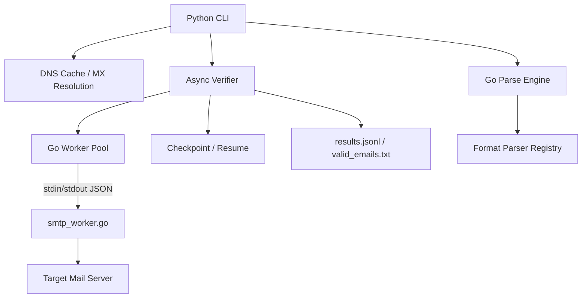

# Stinger

High-performance SMTP email verifier — Python async orchestration with a Go worker for raw socket-level SMTP probing, packaged as a CLI tool. Open-sourced on GitHub.

---

## Overview

Stinger checks whether email addresses actually exist, without sending anything — it talks directly to each domain's mail server over SMTP, gets as far as `RCPT TO`, and reads the server's response to determine whether the address would be accepted. It's built for validating email lists (marketing lists, imported contacts, deliverability cleanup) before actually sending to them, since bad addresses hurt sender reputation and bounce rates.

The tool is aimed at anyone needing to verify a real volume of email addresses without paying for a third-party verification API — it runs the SMTP conversation directly against each domain's own mail servers.

---

## Engineering Summary

Stinger's core engineering decision is splitting the problem across two languages by what each is actually good at: Python owns orchestration — async concurrency control, DNS resolution and caching, retry logic, checkpointing, CLI — while Go owns the part that needs to be fast and cheap to run thousands of times: raw SMTP socket probing and multi-format file parsing. The two talk over newline-delimited JSON through long-lived subprocess pipes rather than forking a process per email, with automatic detection and restart of dead workers.

The result reads like a tool built by someone who understands SMTP well enough to write the protocol by hand (banner parsing, EHLO/HELO fallback, opportunistic STARTTLS, `MAIL FROM`/`RCPT TO`) rather than reaching for a library, and who understands the operational reality of email verification — catch-all domains, per-domain rate limits, retryable vs. permanent failures, DNS/SPF prerequisites — well enough to build tooling around each of those problems specifically, rather than just wrapping a raw SMTP call.

---

## Key Features

* Direct SMTP-level verification (`RCPT TO` probing) against real mail servers — no third-party API
* Persistent Go worker pool communicating over stdin/stdout, avoiding per-check process spawn cost
* Catch-all domain detection with a synthetic probe address, cached per domain
* Two-tier concurrency control — global connection limit plus a per-domain limit to avoid hammering any single provider
* Retry logic that distinguishes permanent rejections from transient/greylisted failures, retrying across multiple MX hosts with exponential backoff
* Checkpoint/resume support — interrupted runs pick back up without re-checking completed addresses
* A `doctor` command that validates the sending server's own DNS/PTR/SPF setup before any checks run
* A Go-based parser supporting 32 input file formats (CSV, PDF, DOCX, archives, mailbox formats, and more), with a raw-strings fallback for anything unrecognized
* Live progress bar, JSONL result output, and a `stats` command for summarizing past runs

---

## Technical Stack

**Orchestration**
Python 3 (asyncio), `dnspython`

**Performance-Critical Worker**
Go — raw SMTP socket implementation, multi-format file parsing

**Interface**
CLI (Python), YAML configuration

**Testing**
pytest (Python, multi-version matrix), Go's built-in testing with the race detector

**CI**
GitHub Actions — separate Go/Python/lint/build-verification jobs

---

## Architecture

The Python side is the entry point and orchestrator: it resolves and caches MX records, detects catch-all domains, applies global and per-domain concurrency limits, and manages retries. Actual SMTP conversations are delegated to a pool of long-running `smtp_worker` Go processes — each one is a persistent daemon that reads a job as a line of JSON on stdin, opens a raw TCP connection to the target mail server, performs the SMTP handshake (including opportunistic STARTTLS) up through `RCPT TO`, and writes the result back as a line of JSON on stdout. One process handles many jobs sequentially over its lifetime, rather than being spawned fresh per email.

A separate Go binary handles file parsing: a worker pool reads files matched against a registry of per-format parsers (extension → parser interface), streaming discovered emails into a channel; a single-threaded consumer deduplicates them via FNV-64 hashing and writes the result, avoiding lock contention on the output file entirely by construction rather than by locking.

---

## Interesting Engineering Decisions

**Long-lived worker processes over per-job subprocess spawning.** Spawning a new OS process for every email checked would dominate runtime at any real volume. Keeping a fixed pool of Go processes alive for the whole run, feeding them jobs over a persistent pipe, amortizes that cost to effectively zero after startup.

**Hand-written SMTP protocol instead of a library.** Verification specifically needs to stop right after `RCPT TO` and read the raw response code — most SMTP libraries are built for sending, not probing, and wrapping one to stop mid-conversation would fight the abstraction more than it would help. Writing the handshake directly gives exact control over what's sent and exactly when the connection closes.

**Two-tier concurrency (global + per-domain).** A high global concurrency limit is good for overall throughput, but sending 100 simultaneous connections to `gmail.com` alone is a fast way to get an IP blocked. Separate semaphores for the global pool and per-domain pool let the tool run wide across many domains while staying polite to any single one.

**A `doctor` preflight command.** SMTP verification depends entirely on the sending server having correct PTR/SPF/A records — without them, most mail servers won't even complete a conversation, and results come back meaningless rather than obviously broken. Building a dedicated diagnostic command that checks this upfront turns a confusing "everything returned unknown" outcome into an actionable "your PTR record doesn't match" one.

**Checkpointing via atomic write-then-rename.** The checkpoint file is written to a temp path and renamed into place rather than written in place, so a crash mid-write can't leave a corrupt checkpoint that a resumed run would choke on.

---

## Challenges

**Distinguishing a genuinely invalid address from a temporarily unavailable one.** SMTP response codes are classified explicitly: 250/251 is valid, 550-554 is a permanent rejection, 421/450/451 and network errors are treated as retryable. Getting this classification right (rather than treating every non-250 as invalid) is what keeps the tool from reporting false negatives on servers that are just greylisting or momentarily busy.

**Catch-all domains silently invalidating results.** Some mail servers accept RCPT TO for any address regardless of whether it exists, which would otherwise make every address on that domain look "valid." Solved with an explicit catch-all probe (a synthetic, near-certainly-nonexistent address) per domain, cached so it only runs once per domain per run rather than once per email.

**Concurrent catch-all detection race.** Multiple emails on the same uncached domain could trigger the catch-all probe simultaneously. A per-domain `asyncio.Lock` combined with a double-check of the cache after acquiring it (check → lock → check again) ensures the probe only actually runs once, even when many coroutines hit an uncached domain at the same moment.

---

## Performance & Scalability

* Configurable global concurrency (default 100 simultaneous connections) and per-domain concurrency (default 2)
* MX and catch-all results cached with configurable TTLs to avoid repeat DNS/SMTP work within a run
* Persistent worker processes eliminate per-check process-spawn overhead
* File parsing uses a worker-pool-per-file-plus-single-consumer pipeline, so parsing scales with file count without contending on the output writer
* README-documented throughput expectations (roughly 1-3 minutes for 1,000 addresses, scaling with MX latency and per-domain throttling) — realistic framing rather than an inflated benchmark

---

## Reliability

* Dead worker detection and automatic restart, with one retry before a job is reported as failed rather than silently dropped
* Checkpoint/resume support for interrupted runs, with atomic checkpoint writes
* Explicit DNS resolvers (not relying on system resolver configuration, which the code notes is unreliable in some macOS environments) with a documented fallback to public resolvers
* Retry with exponential backoff for transient SMTP and DNS failures
* A DNS smoke test (resolving `gmail.com`'s MX records) runs before the main verification pass, to fail fast if the resolver setup is broken rather than misreporting every result as `unknown`

---

## Security Considerations

* No credentials or secrets involved — SMTP verification here doesn't authenticate against target servers, it only performs the unauthenticated envelope steps every mail server accepts by design
* `InsecureSkipVerify: true` is used for the opportunistic STARTTLS upgrade — deliberate: the goal is completing the handshake to reach `RCPT TO`, not certificate validation, and TLS here is opportunistic transport encryption rather than an identity check
* Config file requires a real, DNS-verified domain for `helo_hostname`/`mail_from` — the tool's own `doctor` command exists specifically to prevent it from being run in a way that gets the sending IP blocklisted

---

## Lessons Learned

The persistent-worker-pool pattern (long-lived subprocess, JSON-over-pipe protocol, restart-on-death) turned out to be broadly reusable — the same shape shows up for both the SMTP worker and the file parser, and it's a pattern worth reaching for whenever a fast language needs to be called from Python at a volume where process-spawn cost would otherwise dominate. Writing the SMTP handshake by hand also gave a much clearer picture of the protocol's actual failure modes (multi-line responses, greylisting behavior, catch-all servers) than any library would have surfaced.

---

## Technologies Demonstrated

* Cross-language architecture (Python orchestration + Go workers) with a defined IPC protocol
* Raw network protocol implementation (SMTP) at the socket level
* Concurrent programming with layered rate limiting (global + per-key)
* DNS resolution, caching, and preflight diagnostics
* Crash-safe checkpointing and resumable long-running jobs
* Plugin-style architecture for extensible file-format parsing
* Multi-language CI (Go race detector + multi-version Python matrix + linting + build verification)

---

## Suitable Portfolio Categories

Backend Engineering · Networking · Automation · Distributed Systems · Open Source